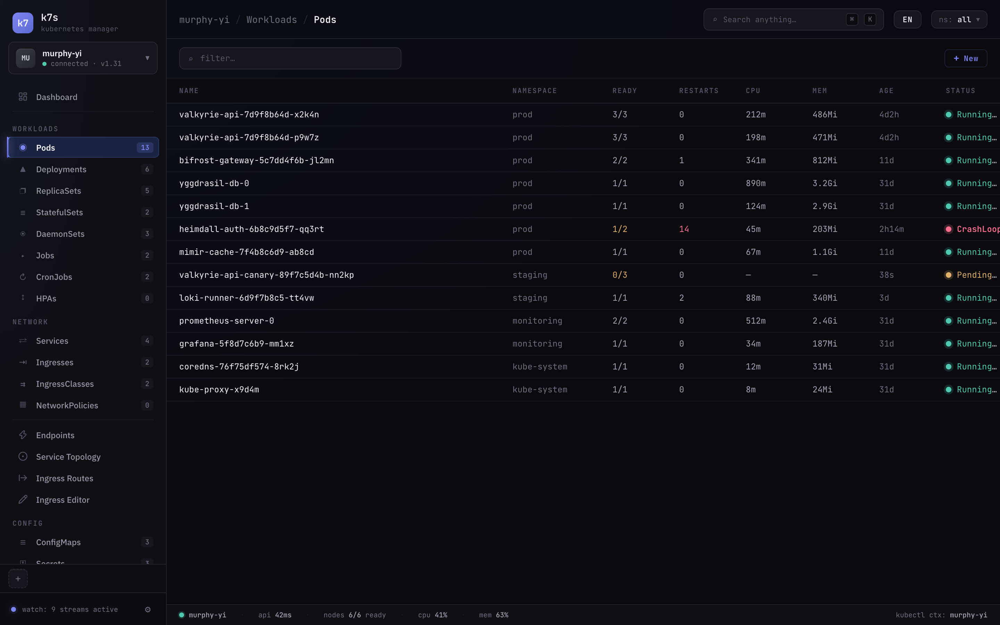
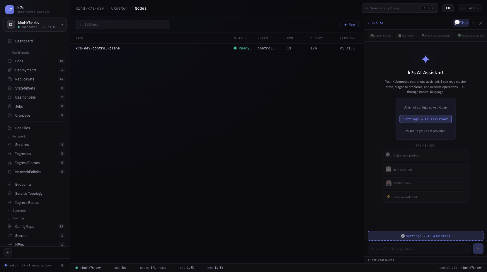
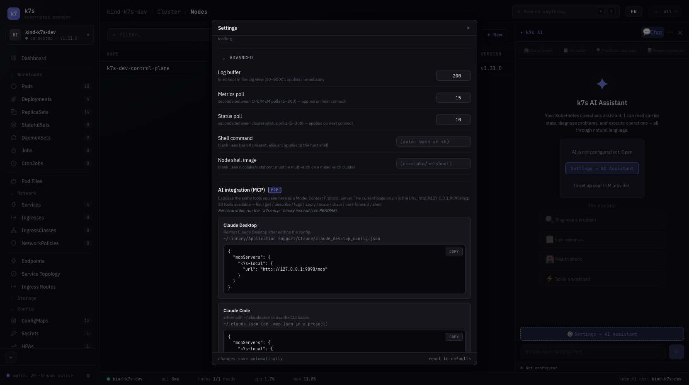
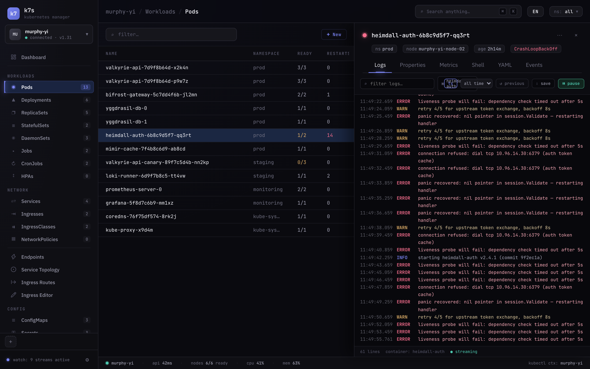
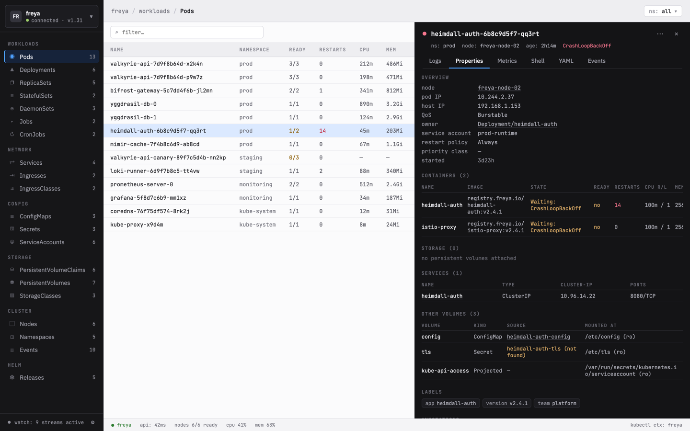
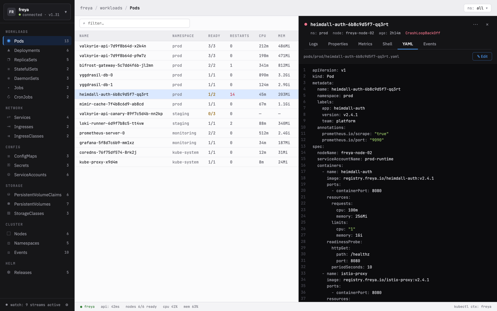
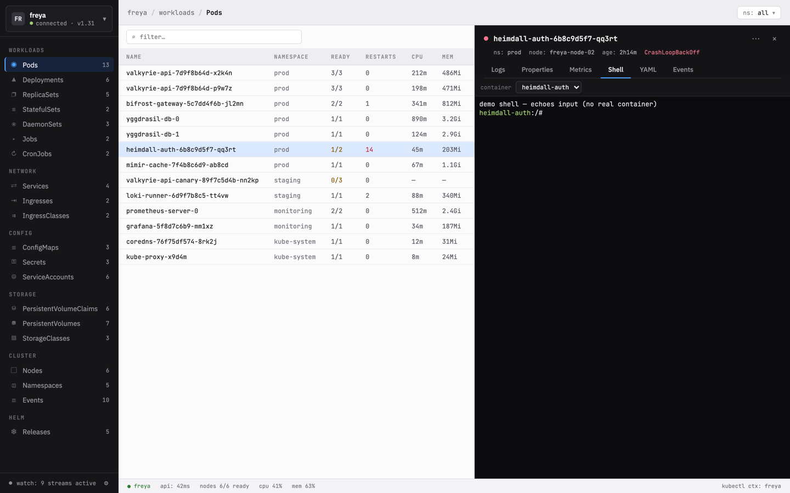
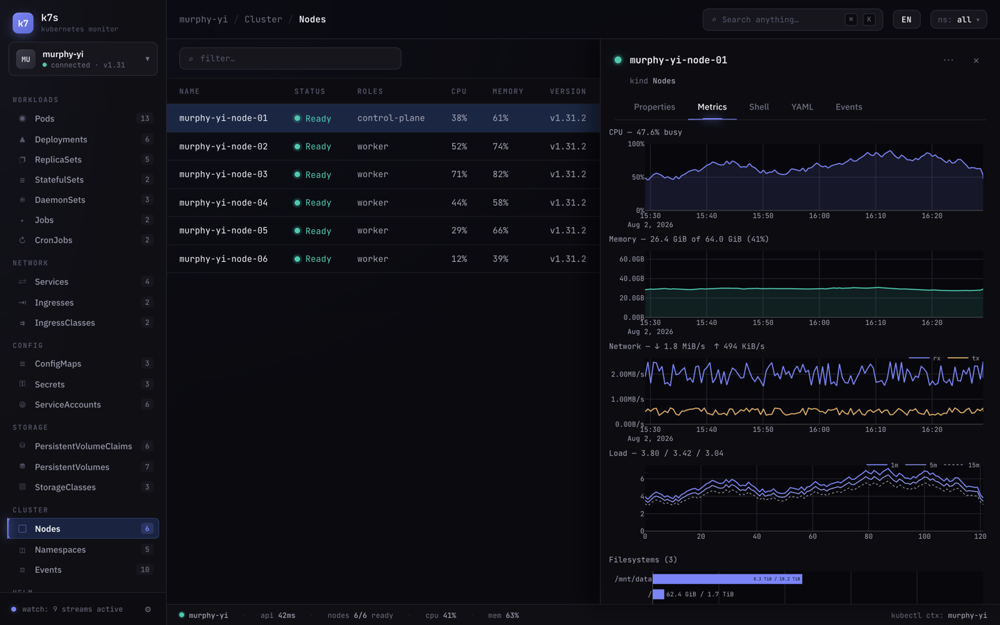
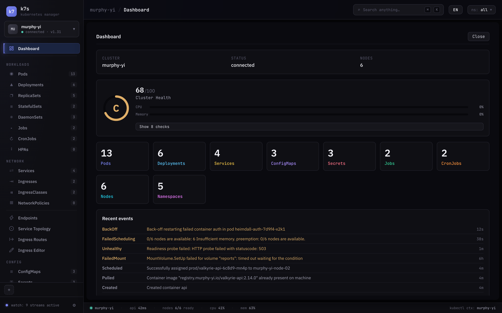

# k7s

> A desktop-grade Kubernetes monitor with a Linear / Vercel aesthetic — **and** a stdio + HTTP MCP server (91 tools) so any AI client can drive a real cluster the same way.



> `k7s` — because `t` is a `7` in 1337-speak.

**Languages / 语言**: [English](README.md) · [简体中文](README.zh-CN.md)

A dark, Lens-style Kubernetes visual monitor built with **Tauri 2 + Rust + React**, plus three interchangeable shells from one codebase: a native **desktop app** (`k7s`), a single-binary **web server** (`k7s-web`), and a **MCP server** (`k7s-mcp`) that exposes the full surface to AI clients.

Targets **macOS** and **Linux** (desktop), runs in **any browser** via `k7s-web`, and ships a **multi-arch Docker image**. Inspired by [k9s](https://k9scli.io/) and the [lyuke/k7s](https://github.com/lyuke/k7s) reference project.

---

## Table of contents

- [🚀 Quick start](#-quick-start)
- [🤔 Why k7s (vs Lens / KubePi / Headlamp)](#-why-k7s-vs-lens--kubepi--headlamp)
- [✨ Features](#-features)
- [🧠 Built-in AI Assistant](#-built-in-ai-assistant)
- [🤖 MCP server — 91 tools](#-mcp-server--91-tools)
- [🖼 Three ways to run](#-three-ways-to-run)
- [📸 Screenshots](#-screenshots)
- [🧱 Tech stack](#-tech-stack)
- [📁 Project layout](#-project-layout)
- [🎨 Design language](#-design-language)
- [🚀 Develop](#-develop)
- [📦 Build a release](#-build-a-release)
- [🐳 Docker / server deployment](#-docker--server-deployment)
- [🪟 Windows / web server mode](#-windows--web-server-mode)
- [🧪 Testing](#-testing)
- [🧩 Extending k7s](#-extending-k7s)
- [🗺 Roadmap](#-roadmap)
- [📄 License](#-license)
- [👤 Author](#-author)

---

## 🚀 Quick start

**macOS (Apple Silicon) / Linux — one-liner:**

```bash
curl -fsSL https://raw.githubusercontent.com/yi-nology/k7s/main/install.sh | bash
```

The script auto-detects OS + arch, downloads the latest release, and installs it:

- **macOS** (Apple Silicon): mounts the `.dmg`, copies `k7s.app` to `/Applications`
- **Linux (deb)**: installs the `.deb` via dpkg (Debian/Ubuntu)
- **Linux (rpm)**: installs the `.rpm` via dnf/yum (Fedora/RHEL/CentOS)
- **Linux (fallback)**: installs the `.AppImage` to `~/.local/bin/`
- Supports **amd64** and **arm64**

**Or pull the Docker image:**

```bash
docker run -d --name k7s -p 8080:8080 \
  -v ~/.kube/config:/home/k7s/.kube/config:ro \
  ghcr.io/yi-nology/k7s:latest
# → open http://localhost:8080
```

**Windows / macOS Intel:** grab the installer from [GitHub Releases](https://github.com/yi-nology/k7s/releases). Windows users: see [Windows / web server mode](#-windows--web-server-mode).

---

## 🤔 Why k7s (vs Lens / KubePi / Headlamp)

k7s, [Lens](https://k8slens.dev/), [KubePi](https://github.com/1Panel-dev/KubePi) and [Headlamp](https://headlamp.dev/) are all Kubernetes dashboards, but they were built for different audiences. The choice is less about *checkbox parity* and more about **who's holding the mouse** and **whether an AI is in the loop**. Below is an honest, feature-level comparison so you can decide.

> Legend: ✅ built-in · ◐ partial / via extension · — not available

### Capability matrix

| Capability | **k7s** | **Lens** | **KubePi** | **Headlamp** |
|---|:---:|:---:|:---:|:---:|
| **🤖 AI / MCP server** | | | | |
| MCP server (stdio + HTTP) | ✅ **91 tools** | — | — | — |
| AI cluster diagnostics (`diagnose_cluster`, `suggest_fix`) | ✅ | — | — | — |
| Cluster health score (0–100, letter grade) | ✅ | — | — | — |
| **🧭 Browsing & ops** | | | | |
| Multi-cluster switching | ✅ | ✅ | ✅ | ✅ |
| Virtualised tables (large clusters) | ✅ | ✅ | ◐ | ◐ |
| CRD discovery (Lens-style grouping) | ✅ | ✅ | ◐ | ✅ |
| Bulk actions (delete / scale / restart) | ✅ | ◐ | ◐ | ◐ |
| Node drain (PDB-aware, progress banner) | ✅ | ✅ | ◐ | — |
| Command palette (⌘K) | ✅ | ✅ | — | — |
| Pod shell (kubectl exec, xterm.js) | ✅ | ✅ | ✅ | ✅ |
| Node shell (privileged debug pod) | ✅ | ✅ | — | — |
| Port-forward manager (pod + service) | ✅ | ✅ | ◐ | ◐ |
| **📜 Logs, YAML & files** | | | | |
| Streaming logs (follow, since-window, search) | ✅ | ✅ | ✅ | ✅ |
| YAML editor + server-side dry-run diff | ✅ | ◐ | ◐ | ◐ |
| Pod file browser (read/write/upload/download) | ✅ | ◐ | ✅ | — |
| Resource diff (side-by-side) | ✅ | — | — | — |
| Ingress visual editor | ✅ | — | — | — |
| **📦 Helm** | | | | |
| Helm release view | ✅ | ✅ | ✅ | ✅ |
| Chart marketplace (repo CRUD + search) | ✅ | ◐ | ✅ | ◐ |
| Install / upgrade / rollback w/ live logs | ✅ | ✅ | ✅ | ◐ |
| **🖼 Observability** | | | | |
| Prometheus PromQL explorer | ✅ | ✅ | ◐ | — |
| AlertManager alerts / silences / rules | ✅ | ◐ | — | — |
| Grafana dashboard embed + search | ✅ | ◐ | — | — |
| Loki / K8s audit-log search | ✅ | — | — | — |
| Node-exporter live metrics | ✅ | ◐ | — | — |
| Service topology graph (d3) | ✅ | ◐ | — | — |
| **🔐 Security & supply chain** | | | | |
| RBAC security audit | ✅ | — | ◐ | — |
| SBOM generation (CycloneDX / SPDX) | ✅ | — | — | — |
| Image vulnerability scan | ✅ | — | ◐ | — |
| Private OCI registry browser | ✅ | ◐ | ✅ | — |
| **Air-gapped** image transfer (skopeo / node import) | ✅ | — | — | — |
| **🧩 Extensibility** | | | | |
| Plugin API (sidebar / tabs / cards / actions) | ✅ | ✅ | — | ✅ |
| Built-in plugin examples (GPU monitor, …) | ✅ | ◐ | — | ◐ |
| **🌐 UX & i18n** | | | | |
| Dark / light / system theme | ✅ | ✅ | ◐ | ◐ |
| Multi-language (EN / 中文) | ✅ | ◐ | ✅ | ◐ |
| Mock/demo mode (no cluster needed) | ✅ | ◐ | — | — |
| **👥 Team / multi-tenant** | | | | |
| SSO (OIDC / SAML / LDAP) | — (kubeconfig) | ◐ | ✅ | ✅ |
| Built-in RBAC + audit log | — | — | ✅ | ◐ |

### Architecture at a glance

| | **k7s** | **Lens** | **KubePi** | **Headlamp** |
|---|---|---|---|---|
| **Shape** | ~9 MB native binary (Tauri 2) | Electron app (~300 MB) | web app (Go + Vue) | web app (Go + React) |
| **Deploy** | installer / Docker / source | desktop installer | `docker run` | `docker run` / in-cluster plugin |
| **Primary user** | single SRE / platform engineer | single dev / SRE | team sharing one dashboard | team / platform |
| **Local data** | reads `~/.kube/config` directly | reads `~/.kube/config` | points a cluster at a kubeconfig | OIDC or kubeconfig |
| **Auth model** | your kubeconfig (RBAC, exec plugins) | kubeconfig / OIDC | OIDC / SAML / LDAP / MFA / RBAC | OIDC |
| **Bundle size** | ~9 MB | ~300 MB | hundreds of MB | ~50 MB |
| **Telemetry** | none | crash reports | login + op log to DB | none |
| **Platforms** | macOS, Linux, **any browser**, Docker | macOS, Linux, Windows | any browser | any browser |

### Who should pick what

- **Pick k7s** if you want a **fast, native, single-binary** K8s monitor with **first-class AI control** (91 MCP tools, cluster diagnostics), **deep observability** (Prometheus + Grafana + AlertManager + Loki in one app), and **supply-chain tooling** (SBOM, air-gapped image transfer) — and you don't need SSO/RBAC for a shared team web login.
- **Pick Lens** if you want the **most mature desktop K8s IDE** with the **largest extension marketplace** and you're happy on a heavyweight Electron app.
- **Pick KubePi** if you need **SSO + RBAC + audit log** for a **shared team installation** behind a web login, with Helm marketplace and image-registry management built in.
- **Pick Headlamp** if you want a **clean, plugin-friendly web dashboard** with strong **OIDC** support that can also run as an in-cluster plugin.

### Where k7s and KubePi overlap

Both have grown toward each other and now share four operator-facing panels — **Helm Marketplace** (repo CRUD + chart search + install/upgrade/rollback with live logs), **Pod Files** (browse/read/write/upload/download via `tar` over exec), **Image Registries** (OCI Distribution v2, Harbor/GHCR/ECR/Docker Hub), and **YAML Templates** (form → preview → apply).

Where **k7s pulls ahead**: the **MCP server** (unique), **air-gapped image transfer**, **SBOM generation**, **Prometheus/Grafana/Alertmanager/Loki observability**, **service topology graphs**, **resource diff**, **Ingress editor**, **node shell**, and the **plugin system** — none of which KubePi ships.

Where **KubePi pulls ahead**: **multi-tenant SSO** (OIDC/SAML/LDAP/MFA), **built-in RBAC down to the namespace**, and an **operation audit log** — k7s is a single-user tool by design.

---

## ✨ Features

### Core shell

- **Multi-cluster** — kubeconfig context switcher with on-the-fly import (native OS file picker; remembers imported files)
- **Cluster switcher + Hotbar** — live connection dot + API version status line; up to 8 pinned-favorite clusters, click-to-switch, right-click-to-remove
- **Dashboard** — the home view: cluster info card, **health ring + score** with expandable checks, CPU/MEM utilisation bars, 9 resource-count cards (click-through), **Resource Quotas** progress bars, and a paginated recent-events feed
- **StatusBar** — connection dot + cluster name, API latency (ms), nodes ready X/Y, cluster CPU% / MEM%, active context
- **Command palette** (⌘K / `:`) — fuzzy-find a kind, an object, or an app command; reads already-loaded rows, instant
- **Settings** — log buffer cap, poll intervals, default namespace, shell command, node-shell image, theme, language — all persisted, most take effect immediately
- **Per-cluster prefs** — last nav, namespace, theme, language, imported kubeconfigs, hotbar: all restored on the next launch

### Resource browsing

- **Live tables** for every common resource: Pods, Deployments, ReplicaSets, StatefulSets, DaemonSets, Jobs, CronJobs, Services, Ingresses, IngressClasses, NetworkPolicies, PVCs, PVs, StorageClasses, ConfigMaps, Secrets, HPAs, ResourceQuotas, LimitRanges, PDBs, MutatingWebhooks, ValidatingWebhooks, APIServices, ServiceAccounts, Roles, ClusterRoles, RoleBindings, ClusterRoleBindings, Nodes, Namespaces, Events, **Helm Releases**
- **CRD discovery** — custom (CRD-backed) kinds are folded under their API group, Lens-style; watcher starts lazily on open
- **Virtualised tables** for any list over 200 rows; filtering, sorting, metrics overlay and tone-coloring still work over the full dataset
- **Multi-tab detail panel** — open 2+ resources as tabs (middle-click to close)
- **Detail tabs** (per-kind): Logs · Properties · Revisions · Metrics · Pods · Shell · YAML · Events · **CronJob Timeline**
- **Properties** — backend-rendered sections (field grids, tables, chips); secret value decoding; clickable cross-kind navigation
- **YAML editor** — CodeMirror 6 with server-side **dry-run diff preview** (only changed regions), then apply

### Detail tabs

| Tab | Available for | What it does |
|---|---|---|
| **Logs** | Pods | streaming viewport, container cycler, follow/pause, since-window, timestamp toggle, level colouring, search, save-to-file, previous-container |
| **Properties** | 26 kinds + CRDs | status, conditions, labels, selectors, containers, volumes — the same JSON the UI uses |
| **Revisions** | Deployment / StatefulSet / DaemonSet | revision history + rollback |
| **Metrics** | Pods + Nodes | Plotly charts for CPU, memory, network, load, filesystem (pods via metrics.k8s.io; nodes via node-exporter) |
| **Pods** | Nodes | pods scheduled on this node, with live CPU/MEM |
| **Shell** | Pods + Nodes | real `kubectl exec` in xterm.js; node shell via privileged debug pod (explicit click-to-connect gate) |
| **YAML** | all kinds | view / edit / dry-run-diff / apply |
| **Events** | all kinds except Helm | Normal/Warning cards with time-range filter |
| **Timeline** | CronJobs | horizontal timeline of recent Job executions coloured by status |

### Actions

Bulk-aware context menus shared between the detail "⋯" menu and the table right-click menu, with confirmations that list the names being acted on:

- **view-pods** (jump), **forward** (form), **scale** (form), **restart** (confirm, bulk), **rollback** (form), **cordon / uncordon** (immediate, bulk), **drain** (confirm, danger — streams progress), **delete** (confirm, danger, bulk), **download-yaml** (immediate, bulk), **modify-image** (per-container rewrite), **files** (open Pod Files), **edit-ingress** (open Ingress Editor)
- **Node drains** show a progress banner in the detail header that survives navigation, reporting PDB-blocked pods
- **Port forwards** — service or pod, OS-assigned local port, strip of active forwards, click-to-copy `localhost:<port>`, error highlighting

### Observability (Tools → Observability)

- **Metrics Explorer** — PromQL query panel. Instant (table) and Range (Plotly line chart) modes, range presets (5m–24h), multi-instance picker, plus **Saved Queries** (list / save / run / remove + cache-clear)
- **Alerting** — AlertManager instances (CRUD); three tabs: **Alerts**, **Silences** (create/expire), **Rules** (read-only Prometheus alerting rules)
- **Grafana** — manage Grafana instances (add/test/remove with username/password/apiToken), preset dashboards, **dashboard search**, and a **sandboxed iframe** embedding the selected dashboard

### Security (Tools → Security)

- **Audit** — K8s audit-log viewer backed by **Loki**. Instance CRUD, query by namespace/resource/user/since, filterable results table with expandable rows
- **SBOM** — Software Bill of Materials. Generate **CycloneDX / SPDX** for a container image (via trivy → grype → native fallback), browse **History** of past reports, render components + vulnerabilities with severity colouring, **export to JSON**
- **RBAC Security Audit** — scan Roles / ClusterRoles / Bindings for misconfigurations with severity-ranked findings *(code present; see [Extending k7s](#-extending-k7s))*

### Images (Tools → Images)

- **Image Registries** — manage private OCI registries (Harbor / GHCR / ECR / Docker Hub; passwords never rendered back), browse repositories → tags → manifest (OCI Distribution v2 with bearer-auth dance), and run **vulnerability scans** with a severity summary + sortable table
- **Image Transfer** — air-gapped cluster image import/export. **Import** a local `.tar` into a node's container runtime via a privileged debug pod; **Export** via `skopeo copy` into a private registry. Desktop/Tauri only

### Networking (Network group)

- **Endpoints** — EndpointSlices table with ready/total counts and a drill-down to backing addresses + the pod each points to (the "503 no endpoints" debugging path)
- **Service Topology** — d3 force-directed graph of Service ↔ Pod ↔ Node relationships, with a service list sidebar, search, and a health summary bar
- **Ingress Routes** — left-to-right SVG flow diagram of Ingress → Service routing chains, with TLS heuristics
- **Ingress Editor** — visual editor: structured form for rules (host/paths/pathType/service/port), TLS, annotations → generates YAML → dry-run → apply

### Tooling (Tools → Tooling)

- **Templates** — create-from-form wizard. 15 templates across workloads / networking / config / storage, with labels chip list, resource requests, live YAML preview, dry-run → apply
- **Diff** — side-by-side YAML comparison. Left = live resource; right = pasted text or another resource. Unified LCS-based diff with green/red highlighting and a diff stat
- **Pod Files** — browse/read/write/download/upload files inside a running container via tar over kubectl exec. Two-pane directory tree + content editor

### Helm (Helm group)

- **Helm Market** — chart marketplace: repo CRUD (add/remove/refresh-all), chart search across cached `index.yaml`, and a 3-step install/upgrade wizard (version → values → review/dry-run) with **live helm-op log streaming**

### System

- **Plugins** — lists installed plugins with enable/disable toggles; built-in **GPU Monitor** dashboard card (NVIDIA DCGM via Prometheus, graceful degradation) and a Network Policy Viewer detail-tab plugin
- **MCP panel** — surfaces the running `k7s-web` instance as an MCP endpoint with ready-to-paste configs for **Claude Desktop, Claude Code, Cursor**

### Cross-cutting

- **Theme** — dark / light / follow system; chrome (titlebar, scrollbars, controls) follows the OS when on "system"; no theme/locale flash (inline pre-paint script reads `localStorage`)
- **i18n** — English and Simplified Chinese, switchable from the top bar or Settings; `<html lang>` updates live; group/kind/tab labels all translated
- **Error handling** — global `ErrorBoundary` + error-toast surface

---

## 🧠 Built-in AI Assistant

k7s ships an **embedded AI agent** — a chat panel inside the app that can diagnose, inspect, and operate your cluster using natural language. It runs a full **ReAct (Reasoning + Acting) loop**: the LLM thinks, picks a tool, asks for permission if needed, executes, observes the result, and repeats until the task is done.

> The built-in AI assistant is **separate from** the MCP server. The MCP server exposes 91 tools to external AI clients (Claude Desktop, Cursor, etc.); the built-in assistant is a self-contained agent **inside k7s** with its own ~12 optimized tools, permission gate, skills, and memory.

### Screenshots

| AI Chat Panel | AI Settings |
| --- | --- |
|  |  |

### How it works

```
User prompt
    ↓
LLM (reasoning) → selects tool → Permission Gate → execute → observe result
    ↓                                                          ↓
    ← ← ← ← ← ← ← ← loop until done ← ← ← ← ← ← ← ← ← ←
    ↓
Final answer (Markdown)
```

### Supported LLM providers

Any **OpenAI-compatible** API works. Tested providers:

| Provider | Base URL | Model examples |
|---|---|---|
| **DeepSeek** | `https://api.deepseek.com/v1` | `deepseek-chat`, `deepseek-reasoner` |
| **OpenAI** | `https://api.openai.com/v1` | `gpt-4o-mini`, `gpt-4o` |
| **Kimi (Moonshot)** | `https://api.moonshot.cn/v1` | `kimi-k2` |
| **Zhipu (GLM)** | `https://open.bigmodel.cn/api/paas/v4` | `glm-4-flash` |
| **Ollama** | `http://localhost:11434/v1` | `qwen2.5`, `llama3`, any local model |
| **Custom** | any OpenAI-compatible URL | — |

API keys are stored encrypted in the **OS keychain** (macOS Keychain / Linux Secret Service) — never in plaintext config files.

### Permission modes

The permission gate is the hard boundary between the AI and your cluster:

| Mode | Read tools | Write tools | Use case |
|---|---|---|---|
| **ReadOnly** | ✅ auto | ❌ blocked | Safe exploration, no cluster mutations |
| **ReadConfirmWrite** (default) | ✅ auto | 🔔 pause for approval | Daily driver — you stay in control |
| **FullAuto** | ✅ auto | ✅ auto | Power user / demo — use with care |

Write tools include: `scale_workload`, `restart_workload`, `delete_resource`, `apply_manifest`, `cordon_node`, `drain_node`. In **ReadConfirmWrite** mode, the agent pauses and shows a confirmation card with the tool name and arguments before executing.

> **Web mode** (`k7s-web`) forces **ReadOnly** regardless of config — the AI can never mutate your cluster through the web UI.

### Built-in tools (~12)

The agent has its own optimized tool set, independent from the MCP server's 91 tools:

| Group | Tools | Description |
|---|---|---|
| **Read** | `list_resources`, `get_resource`, `describe_resource`, `get_events`, `get_pod_logs`, `top_pods`, `top_nodes` | Browse and inspect any K8s resource |
| **Diag** | `diagnose_cluster`, `suggest_fix`, `cluster_health` | Structured cluster diagnostics, actionable fixes, 0–100 health score |
| **Write** | `scale_workload`, `restart_workload`, `delete_resource`, `apply_manifest` | Mutating operations (permission-gated) |

### Skills — reusable prompt templates

Skills are pre-built instruction templates that steer the agent toward a specific task strategy. Each skill carries a system prompt suffix, a tool whitelist, and example conversations.

**Built-in skills:**

| Skill | Category | What it does |
|---|---|---|
| **CrashLoopBackOff 诊断** | Troubleshooting | Systematic diagnosis: events → previous logs → root cause → fix steps |
| **PDB 安全 Drain** | Operations | Check PDB constraints before draining a node; never drains without approval |
| **滚动升级 Checklist** | Deployment | Guide through rolling upgrade: check strategy → update image → monitor rollout |
| **资源压力分析** | Analysis | Find CPU/memory pressure by node and namespace; identify resource hogs |

Users can install custom skills as JSON files under `<data_dir>/skills/`.

### Memory

The agent remembers conversation context across turns within a session. The memory panel lets you view, search, and clear stored memories.

### IM integrations (webhook alerts)

k7s can forward AI-generated alerts and summaries to your team chat via webhook:

| Platform | Config |
|---|---|
| **WeChat Work** (企业微信) | Webhook URL |
| **DingTalk** (钉钉) | Webhook URL + optional signing secret |
| **Feishu / Lark** (飞书) | Webhook URL |

### Scheduled AI tasks

Create cron-scheduled AI tasks that run automatically — e.g., "every morning at 9am, check cluster health and send a summary to DingTalk".

### Quick setup

1. Open **Settings → AI** in k7s
2. Toggle **Enable AI Assistant**
3. Enter your LLM provider's **Base URL** and **Model**
4. Enter your **API Key** (stored encrypted in OS keychain)
5. Choose a **Permission mode** (default: ReadConfirmWrite)
6. Click the ✦ icon in the sidebar to open the AI chat panel

### Example prompts

| Prompt | What the agent does |
|---|---|
| *"Diagnose why payment-pod is CrashLooping"* | Runs CrashLoop skill: events → logs → root cause → fix |
| *"Show me all pods in production namespace eating more than 1Gi RAM"* | `list_resources` + `top_pods` → filtered report |
| *"What's the cluster health score?"* | `cluster_health` → 0–100 score + letter grade + breakdown |
| *"Scale deployment/nginx to 5 replicas"* | Permission gate → `scale_workload` → confirm → execute |
| *"Suggest fixes for the failing cronjob"* | `diagnose_cluster` + `suggest_fix` → actionable steps |

---

## 🤖 MCP server — 91 tools

k7s ships a first-party MCP server called **`k7s-mcp`** that exposes the **same Kubernetes plumbing** the desktop and web shells use, over the [Model Context Protocol](https://modelcontextprotocol.io/). AI clients (Claude Desktop, Cursor, Claude Code, …) can drive a real cluster through it.

**91 tools** in total, grouped:

| Category | Tools | Count |
|---|---|---|
| **Connection** | `list_contexts`, `connect`, `disconnect`, `status` | 4 |
| **Read** | `list_resources`, `get_resource`, `describe_resource`, `get_events`, `get_logs`, `batch_get` | 6 |
| **Write** | `apply_yaml`, `dry_run_yaml`, `delete_resource`, `scale_resource`, `set_cordon`, `restart_pod`, `restart_rollout`, `drain_node` | 8 |
| **Shell / exec / port-forward / pod-files / discovery** | `start_port_forward`, `start_service_port_forward`, `stop_port_forward`, `list_port_forwards`, `start_shell`, `shell_input`, `shell_resize`, `stop_shell`, `start_node_shell`, `stop_node_shell`, `exec_command`, `rollout_status`, `top_pods`, `top_nodes`, `trigger_cronjob`, `apply_yaml_bundle`, `dry_run_yaml_bundle`, `list_api_resources`, `list_endpoints`, `pod_list_files`, `pod_read_file`, `pod_write_file`, `pod_download_file`, `pod_upload_file`, `import_kubeconfig`, `default_kubeconfig_path`, `list_builtin_kinds`, `list_custom_kinds` | 28 |
| **Helm** | `helm_install`, `helm_upgrade`, `helm_uninstall`, `helm_rollback`, `helm_history`, `helm_show_values`, `helm_list_repos`, `helm_search_charts`, `helm_add_repo`, `helm_remove_repo`, `helm_update_repo`, `helm_release` | 12 |
| **Monitoring** | `prometheus_query`, `prometheus_query_range`, `alertmanager_alerts`, `alertmanager_silences`, `grafana_dashboard_url`, `grafana_search`, `image_registry_tags`, `image_registry_manifest`, `saved_query_run`, `image_sync_status`, `image_copy`, `image_inspect_archive`, `diagnose_cluster`, `suggest_fix`, `find_resources_by_label`, `create_silence`, `delete_silence`, `list_alert_rules`, `audit_search`, `sbom_generate_image`, `sbom_list_history`, `sbom_get`, `cluster_health` | 23 |
| **Unified / convenience** | `port_forward`, `prometheus_query_unified`, `sbom_unified`, `silence`, `list_kinds`, `diff_resources`, `hpa_status`, `network_policy_audit`, `rbac_who_can`, `cost_estimate` | 10 |
| **Total** | | **91** |

**Read** — list / get / describe / logs / events / metrics for Pods, Deployments, Services, Nodes, Namespaces, and any CRD.

**Write** — apply (single + multi-doc bundles), dry-run diff, delete, scale, restart (pod + rollout), cordon / uncordon, drain, trigger CronJob.

**Execution** — one-shot `exec_command`, interactive pod shells (`start_shell` + input/resize/stop), privileged **node shells** (auto-created debug pod, auto-cleaned), port-forwards (pod + service), `top pods` / `top nodes`, `rollout status`, `list_api_resources`.

**Pod files** — list / read / write / download / upload inside a container.

**Helm** — install / upgrade / uninstall / rollback / history / show-values, plus repo CRUD (add / remove / update / search).

**Monitoring** — PromQL instant + range, AlertManager alerts / silences / rules, Grafana dashboard URL + search, saved-query runner, image registry tags + manifest.

**Image / air-gap** — `skopeo` sync into a registry, tarball inspect.

**Enhanced AI helpers** — `diagnose_cluster` (node health, pod failures, deployment availability, warning events, resource pressure → structured report), `suggest_fix` (actionable fixes for a resource), `find_resources_by_label`, `create_silence` / `delete_silence`, `audit_search` (K8s audit via Loki), `sbom_generate_image` / `sbom_list_history` / `sbom_get`, `cluster_health` (0–100 score + letter grade), `cost_estimate` (per-namespace resource cost), `rbac_who_can` (RBAC query), `network_policy_audit`, `hpa_status`, `diff_resources`, and `batch_get`.

### Choose your transport

| Scenario | Recommended | How to start |
|---|---|---|
| AI client runs on the same machine as k7s | **stdio** (simplest) | `k7s-mcp` |
| AI client talks to k7s over the network | **HTTP** (Streamable HTTP) | `k7s-web` at `/mcp` |

### 1. Local stdio — `k7s-mcp`

```bash
cargo build --release --manifest-path src-tauri/Cargo.toml \
  --features mcp --bin k7s-mcp
# → src-tauri/target/release/k7s-mcp   (~7 MB)
```

Add to your Claude Desktop / Cursor MCP config:

```json
{
  "mcpServers": {
    "k7s": {
      "command": "/abs/path/to/k7s-mcp",
      "args": []
    }
  }
}
```

### 2. Remote / HTTP — `k7s-web`'s `/mcp`

```bash
cargo build --release --manifest-path src-tauri/Cargo.toml \
  --features web --bin k7s-web
# → src-tauri/target/release/k7s-web   (~10 MB)
./k7s-web --addr 0.0.0.0:8080
# → "k7s-web (server) listening on http://0.0.0.0:8080 (MCP: /mcp)"
```

Point the remote AI client at `http://<host>:8080/mcp`. Each remote session gets its own `CoreState` (own client, port-forwards, shells).

### Quick smoke test

```bash
echo '{"jsonrpc":"2.0","id":1,"method":"initialize","params":{"protocolVersion":"2024-11-05","capabilities":{},"clientInfo":{"name":"smoke","version":"0"}}}' \
  | k7s-mcp
```

### Safety notes

- `k7s-mcp` has the **full authority of your current kubeconfig** — it honours your K8s RBAC, but its tools can trigger delete, drain, exec and other high-impact actions. Run it under a dedicated context / service account.
- HTTP mode exposes `/mcp` with **no built-in auth**; put it behind a trusted network or reverse proxy.
- The exec tool runs **arbitrary shell commands** — grant with care.

---

## 🖼 Three ways to run

k7s is one codebase in three shapes. The **desktop** build calls into Rust directly through Tauri; the **browser** build replays the same command surface as JSON-over-HTTP on top of axum; the **MCP** build exposes it as MCP tools. All three share the same `core::` business logic.

| | Desktop (`k7s`) | Web (`k7s-web`) | MCP (`k7s-mcp`) |
|---|---|---|---|
| **Surface** | Tauri window | any browser tab | AI client (stdio / HTTP) |
| **Frontend** | bundled WebView | embedded or external `dist/` | none |
| **Transport** | Tauri IPC | HTTP `/api/*` + SSE | MCP |
| **Live data** | Tauri emits | SSE `GET /api/events` | tool results |
| **Bundle** | ~9 MB | ~10 MB | ~7 MB |
| **Best for** | daily-driver SRE laptop | server / shared box | AI-driven cluster ops |

---

## 📸 Screenshots

### Resource table

A dark, virtualised table for every common resource — Pods, Deployments, Services, CRDs — with tone-coloured status, per-column metrics and a live filter bar.


### Detail panel — Logs · Properties · YAML · Shell

The same row, four different lenses. Logs stream live with a `since` window, Properties lay out the full Pod spec, YAML gives you an in-place CodeMirror editor, and Shell drops you into a real `kubectl exec` session inside xterm.js.

| Logs | Properties |
| --- | --- |
|  |  |

| YAML | Shell |
| --- | --- |
|  |  |

### Metrics & Dashboard

Plotly-powered charts for any node or pod: CPU, memory, network and load, plus filesystem usage, all updated live over a port-forwarded metrics endpoint. The Dashboard is the home view — cluster health ring, resource cards, quotas, recent events.

| Metrics | Dashboard |
| --- | --- |
|  |  |

### 🧠 AI Assistant

The built-in AI chat panel — click the ✦ icon to open. Ask questions in natural language, the agent diagnoses and operates your cluster through a ReAct loop with permission gating.

| AI Chat Panel | AI Settings (Desktop only) |
| --- | --- |
|  |  |

---

## 🧱 Tech stack

| Layer | Choice |
|---|---|
| Desktop shell | [Tauri 2](https://tauri.app) (Rust + WebView) |
| K8s client | [kube-rs](https://github.com/kube-rs/kube) 0.99 + k8s-openapi 0.24 |
| Web server | [axum](https://github.com/tokio-rs/axum) 0.7 + tower-http |
| MCP | [rmcp](https://github.com/modelcontextprotocol/rust-sdk) 3 (stdio + Streamable HTTP) |
| Renderer | React 19 + TypeScript + Vite 6 |
| State | [Zustand](https://github.com/pmndrs/zustand) |
| Styling | Plain CSS with design tokens (`tokens.css`) |
| Terminal | [xterm.js](https://xtermjs.org/) |
| Plots | [Plotly](https://plotly.com/javascript/) (basic-dist-min) |
| Graphs | [d3-force](https://github.com/d3/d3-force) (service topology) |
| YAML editor | [CodeMirror 6](https://codemirror.net/) |
| Icons | [lucide-react](https://lucide.dev/) |
| Fonts | IBM Plex Sans + JetBrains Mono |
| Tests | Vitest + jsdom (frontend), Cargo (Rust) |

---

## 📁 Project layout

```
k7s/
├── src/                        # React renderer
│   ├── components/
│   │   ├── sidebar/            # cluster switcher, hotbar, nav, watch footer
│   │   ├── topbar/             # breadcrumb, ⌘K search, namespace, language
│   │   ├── statusbar/          # connection, API latency, nodes, CPU/MEM
│   │   ├── dashboard/          # health ring, resource cards, quotas, events
│   │   ├── table/              # virtualised resource table + context menu
│   │   ├── detail/             # tabbed panel (Logs, Shell, Properties, …)
│   │   ├── forwards/           # active port-forwards strip
│   │   ├── palette/            # ⌘K command palette
│   │   ├── endpoints/          # EndpointSlices panel
│   │   ├── topology/           # service topology + ingress routes (d3/SVG)
│   │   ├── helm/               # Helm market + install wizard
│   │   ├── metrics/            # PromQL metrics explorer + saved queries
│   │   ├── alerting/           # AlertManager alerts/silences/rules
│   │   ├── grafana/            # Grafana instance mgmt + iframe embed
│   │   ├── audit/              # K8s audit logs via Loki
│   │   ├── sbom/               # SBOM generate / history / vuln table
│   │   ├── imagerepo/          # OCI registries + scan results
│   │   ├── imagetransfer/      # air-gapped image import/export
│   │   ├── templates/          # create-from-form wizard
│   │   ├── diff/               # side-by-side YAML diff
│   │   ├── podfiles/           # container file browser
│   │   ├── ingress/            # visual ingress editor
│   │   ├── plugins/            # plugin manager panel
│   │   ├── settings/           # settings modal (incl. MCP panel)
│   │   └── actions/            # shared action menu + forms
│   ├── lib/
│   │   ├── theme.ts            # palette resolution + token bridge
│   │   ├── settings.ts         # user settings + sanitisation
│   │   ├── i18n/               # dictionaries + translate() (en / zh)
│   │   ├── actions.ts          # action model + bulk runner
│   │   ├── kinds.tsx           # kind registry + per-kind tabs
│   │   ├── palette.tsx         # ⌘K ranking
│   │   ├── plugins/            # plugin manager + API + built-ins
│   │   └── …                   # filter, sort, virtual, drain, diff, format, tone…
│   ├── hooks/                  # useBootstrap, useTheme, useI18n, useTerminal…
│   ├── providers/              # data layer (Tauri + Mock + Http) + typed RPC
│   ├── store/                  # Zustand slices (connection, data, nav, detail)
│   ├── styles/                 # tokens.css + global.css
│   └── App.tsx
├── src-tauri/                  # Rust backend
│   ├── src/
│   │   ├── main.rs             # desktop entry
│   │   ├── lib.rs              # Tauri builder + command registry
│   │   ├── error.rs            # Tauri-friendly error type
│   │   ├── commands/           # #[tauri::command] handlers (~95 commands)
│   │   │   ├── core.rs         #   cluster lifecycle, CRUD, logs, node stats
│   │   │   ├── forward.rs      #   port-forwarding
│   │   │   ├── helm.rs         #   helm marketplace + ops
│   │   │   ├── observability.rs#   prometheus/grafana/alertmanager/loki/saved-queries
│   │   │   ├── sbom.rs         #   SBOM generation + history
│   │   │   ├── security.rs     #   RBAC audit
│   │   │   ├── shell.rs        #   interactive shells (pod + node)
│   │   │   └── storage.rs      #   pod files, registries, images, yaml bundles
│   │   ├── core/               # transport-agnostic business logic
│   │   ├── kube/               # kube client, watchers, mappers, properties, …
│   │   ├── web/                # axum server (k7s-web; --features web)
│   │   ├── mcp/                # MCP server (k7s-mcp; --features mcp)
│   │   └── bin/                # k7s-web, k7s-mcp entry points
│   ├── capabilities/           # Tauri 2 capability allow-list
│   ├── Cargo.toml              # features: web, mcp
│   └── tauri.conf.json
├── crates/probe/               # standalone k7s-probe smoke-test binary
├── design/                     # handoff: K8s Monitor.dc.html + design README
├── dev/                        # run.sh, web.mjs, shots.mjs, k3s-up.sh, qa-reports…
├── docs/                       # screenshots + DEVELOPMENT + TEST_PLAN + specs
├── scripts/pre-commit.sh       # lint + typecheck + test + cargo clippy/fmt/test
├── Dockerfile                  # 3-stage multi-arch → k7s-web runtime
├── docker-compose.yml          # one-service compose
├── install.sh                  # one-click installer (mac/linux)
└── package.json
```

---

## 🎨 Design language

k7s follows a **Linear / Vercel** direction:

- **Near-black surfaces** with cool blue undertones (`#0B0D10` base, `0.06` lift per elevation).
- **Hairline borders** (`1px` at `8–14%` alpha), no heavy dividers.
- **Subtle accent** — the brand teal `#4EC9B0` only on focus / selection / active state.
- **Tone-by-status** for row colors: green for `Running`, amber for `Pending`, red for `Failed`, neutral muted for terminal states. Status colors are tuned per palette so light mode stays legible.
- **Two palettes** — dark (headline) and light (secondary), both tokenised in `src/styles/tokens.css` and switchable from Settings or the top bar.
- **i18n baked in** — every visible string routes through `translate()`, with English + Simplified Chinese dictionaries; missing keys fall back to English.

See [`design/README.md`](design/README.md) for the full v2 spec, the standalone `design/K8s Monitor.dc.html` interactive mockup, and the original hand-off notes.

---

## 🚀 Develop

### Prerequisites

- **Node.js ≥ 18** (tested on 24) + **pnpm 10+**
- **Rust stable** (1.77.2+, MSRV-pinned)
- **macOS**: `xcode-select --install`
- **Linux**: `webkit2gtk-4.1`, `libsoup-3.0`, `libayatana-appindicator3`, `librsvg2`, `openssl-dev`
  - Debian / Ubuntu: `sudo apt install libwebkit2gtk-4.1-dev libsoup-3.0-dev libayatana-appindicator3-dev librsvg2-dev libssl-dev`
  - Fedora: `sudo dnf install webkit2gtk4.1-devel libsoup3-devel libappindicator-gtk3-devel librsvg2-devel openssl-devel`

### Desktop (the intended target)

```bash
pnpm install
pnpm tauri:dev      # Vite on :1420 + Tauri shell
```

### Browser shell (develop k7s-web without Tauri)

```bash
pnpm dev:web        # launches k7s-web (:7180) + Vite (:1420), wires the /api proxy
```

### Scripts

```bash
pnpm dev               # Vite only (use MockProvider for browser-only work)
pnpm tauri:dev         # Tauri + Vite
pnpm tauri:build       # full release bundle
pnpm dev:web           # k7s-web + Vite (browser shell dev)
pnpm dev:shots         # regenerate design-comparison screenshots
pnpm typecheck         # tsc --noEmit
pnpm test              # vitest run
pnpm test:watch        # vitest
pnpm lint / lint:fix   # eslint
pnpm format / format:check
```

### Demo / mock mode

Set `VITE_DEMO=1` in `.env.development.local` to make `MockProvider` serve seeded data so the UI is usable from `pnpm dev` alone (no Tauri, no cluster). The provider is selected at build time based on whether the app is running in a Tauri webview. See `src/providers/index.ts`.

### Local dev cluster

```bash
dev/k3s-up.sh up       # brings up k3d → kind → k3s (in preference order)
dev/k3s-up.sh kc       # prints the kubeconfig path
dev/k3s-up.sh down     # tears it down
```

See [`docs/DEVELOPMENT.md`](docs/DEVELOPMENT.md) for the full guide (VSCode debug configs, recommended extensions, troubleshooting).

---

## 📦 Build a release

```bash
# Desktop (per-platform installers under src-tauri/target/release/bundle/)
pnpm tauri:build

# Browser single binary (~10 MB)
pnpm build                            # writes dist/
cargo build --release --manifest-path src-tauri/Cargo.toml \
  --features web --bin k7s-web

# MCP stdio binary (~7 MB)
cargo build --release --manifest-path src-tauri/Cargo.toml \
  --features mcp --bin k7s-mcp
```

Release binaries are built with `lto=true`, `opt-level="s"`, `strip=true`, `codegen-units=1` for small fast binaries.

### What a release ships

Tagging `v*` triggers the [release workflow](.github/workflows/release.yml), which produces:

- **9 desktop bundles**: `.deb` + `.rpm` + `.AppImage` (arm64 + amd64), `.dmg` (aarch64), `.exe` setup + `.msi` (x64), plus `latest.json` for the Tauri auto-updater
- **3 `k7s-web` binaries**: `k7s-web-{windows-x64,macos-$arch,linux-$arch}`
- **1 multi-arch container image**: `ghcr.io/yi-nology/k7s:{version}/{major}.{minor}/latest` (linux/amd64 + linux/arm64)

---

## 🐳 Docker / server deployment

`k7s-web` is the same repo in a different shape — an axum HTTP server that fronts a prebuilt `dist/` and replays the same command surface over `/api/*` plus SSE, so any modern browser can drive a real cluster. The Docker image ships **k7s-web**, not the Tauri desktop app.

```bash
# 1. Build the front-end (writes dist/ next to the repo root)
pnpm build

# 2. Build the k7s-web binary in release mode
cargo build --release --manifest-path src-tauri/Cargo.toml \
  --features web --bin k7s-web
# → src-tauri/target/release/k7s-web (~10 MB)

# 3. Ship both to the box
#   ./k7s-web
#   ../dist/

# 4. Run
./k7s-web --addr 0.0.0.0:8080
```

Open `http://127.0.0.1:8080/` in a browser. `/api/*` uses SSE for live event streaming; `/mcp` exposes the MCP server over HTTP.

### Docker quick-start

```bash
cp .env.example .env           # K7S_PORT, KUBECONFIG, RUST_LOG
docker compose up -d           # → http://localhost:8080
```

`docker-compose.yml` mounts your kubeconfig read-only, persists prefs to a named `k7s-data` volume, exposes `:8080`, sets a healthcheck, resource limits (2 cpu / 1G), and runs as a non-root user. Multi-arch: `linux/amd64` + `linux/arm64`. See [`DOCKER.md`](DOCKER.md) for the full guide (env vars, data backup/restore, production recommendations).

### `k7s-web` flags

| Flag | Default | Meaning |
|---|---|---|
| `--addr` | `0.0.0.0:8080` | Listen address |
| `--port` | first free | Preferred port (fallback scans) |
| `--kubeconfig` | `KUBECONFIG` env → `~/.kube/config` | Path to kubeconfig |
| `--context` | current context | Override the active context |
| `--static-dir` | `dist/` next to the binary | Frontend static files |
| `--no-mcp` | enabled | Disable the embedded `/mcp` route |
| `--no-open` | opens browser | Don't auto-open the default browser |

### Production checklist

- Keep `dist/` next to the `k7s-web` binary (or use `--static-dir`).
- Open the port you passed to `--addr` in your firewall / security group.
- For container deployments, bind to 127.0.0.1 and put a reverse proxy in front.
- Mount kubeconfig as a secret — never bake it into the image.

---

## 🪟 Windows / web server mode

The k7s desktop app is built on Tauri 2 (WebView2), which needs **Windows 10+**. Windows users can also use the **`k7s-web`** standalone server — the full k7s feature set, accessed through any browser.

1. Download `k7s-web-windows-x64.exe` from [Releases](https://github.com/yi-nology/k7s/releases).
2. Double-click to run.
3. Your default browser opens the k7s UI automatically.

`k7s-web` supports:

- Auto-selection of a free port (with `--port` override)
- Auto-open of the default browser (`--no-open` to disable)
- Embedded MCP server at `/mcp` (AI clients can connect)

```
k7s-web --port 8080        # preferred port
k7s-web --no-open          # don't auto-open the browser
k7s-web --static ./dist    # use an external directory instead of embedded assets
```

---

## 🧪 Testing

```bash
pnpm test              # frontend unit tests (Vitest + jsdom)
pnpm typecheck         # TypeScript strict mode
cd src-tauri && cargo test    # Rust unit tests
cargo run --manifest-path crates/probe/Cargo.toml   # live-cluster smoke probe
```

- **Frontend**: Vitest + React Testing Library; config in `vite.config.ts`.
- **Backend**: `cargo test` plus the standalone `k7s-probe` binary that exercises the full surface against a live cluster (contexts, all resource kinds, logs, exec, port-forward, scale, apply round-trip, describe).
- **CI**: [`.github/workflows/release.yml`](.github/workflows/release.yml) runs a fast `frontend` + `backend` gate on every push/PR (lint, typecheck, test, clippy `-D warnings`, rustfmt), and the full 4-OS build matrix + multi-arch Docker image on `v*` tags.
- **Pre-commit**: [`scripts/pre-commit.sh`](scripts/pre-commit.sh) runs the same four checks locally.

For the full test plan see [`docs/TEST_PLAN.md`](docs/TEST_PLAN.md); recent regression reports live under `dev/qa-reports/` and `dev/TEST_REPORT.md`.

---

## 🧩 Extending k7s

### Add a new resource view

Add your kind to a `KindDef` in `src/lib/kinds.tsx` (label, column definitions, allowed tabs, actions) — the sidebar, table, detail panel and command palette all pick it up automatically. No other file needs to change.

### Add a new locale

Drop a new dictionary into `src/lib/i18n/` (see `en.ts`) and register it in `i18n/index.ts`. Every visible string goes through `translate()`; missing keys fall back to English.

### Plugin system

k7s has a first-class plugin API (`src/lib/plugins/`): `PluginAPIImpl` gives plugins read-only store access, navigation, notifications, resource reads, and runtime registration of **sidebar items**, **detail tabs**, **resource columns**, **actions**, and **dashboard cards**. Built-in plugins ship as examples:

- **GPU Monitor** — a dashboard card querying NVIDIA DCGM / nvidia-device-plugin metrics via Prometheus (GPU count, avg utilisation, memory used/total), with graceful degradation.
- **Network Policy Viewer** — adds a detail tab to Pods/Namespaces.

See [`CONTRIBUTING.md`](CONTRIBUTING.md) for the contribution flow (Conventional Commits, fork → branch → PR, all tests must pass).

> **Note on the RBAC Security Audit panel:** `src/components/security/SecurityPanel.tsx` is implemented (severity-ranked findings, click-through to RBAC resources) but is not currently wired into the sidebar overlay table — it ships as code you can register as a plugin entry. The built-in Network Policy Viewer and Cluster SBOM tab are explicit stubs awaiting their backend.

---

## 🗺 Roadmap

- **Custom dashboards** — draggable cards defined by JSON Schema
- **Multi-cluster in parallel** — aggregated view across contexts in one window
- **Alerting center** — integrated with Alertmanager (deeper than the current Alerts panel)
- **Plugin marketplace** — shareable third-party CRD panels
- **Cluster SBOM** — SBOM across all running images in a cluster

---

## 📄 License

MIT

---

## 👤 Author

[Murphy-Yi](https://github.com/Murphy-Yi) — yi-nology@hotmail.com
