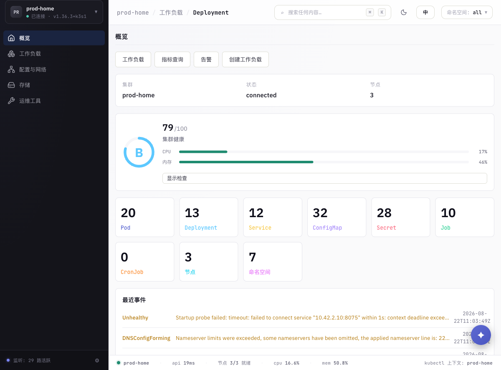
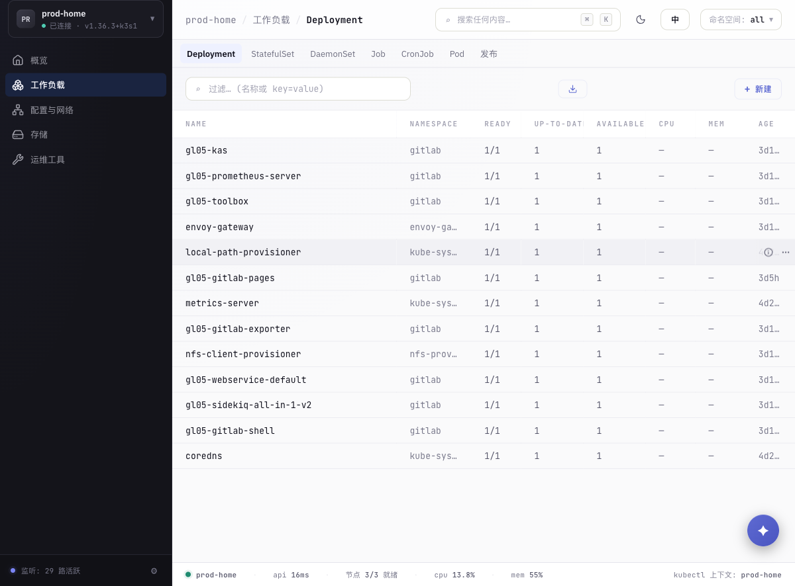
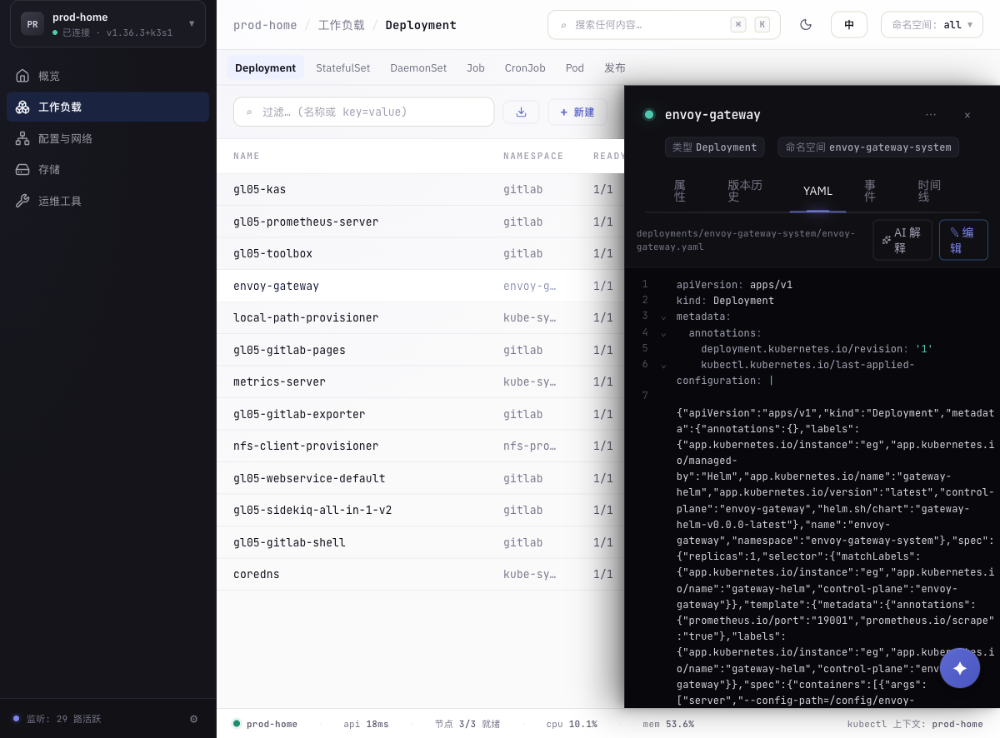
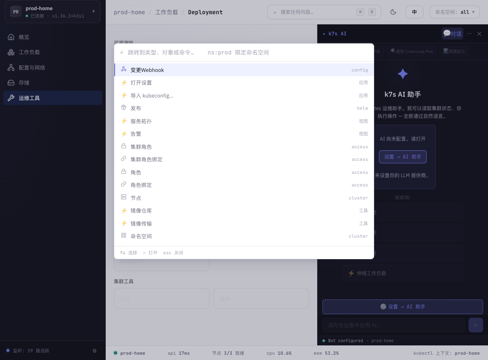
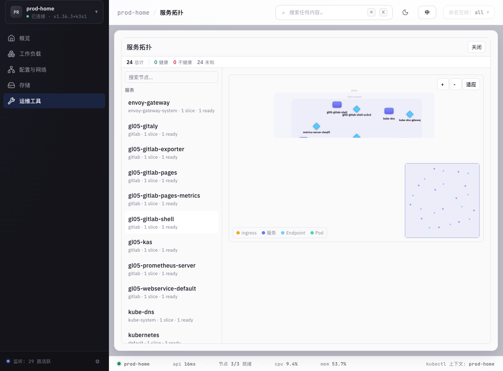
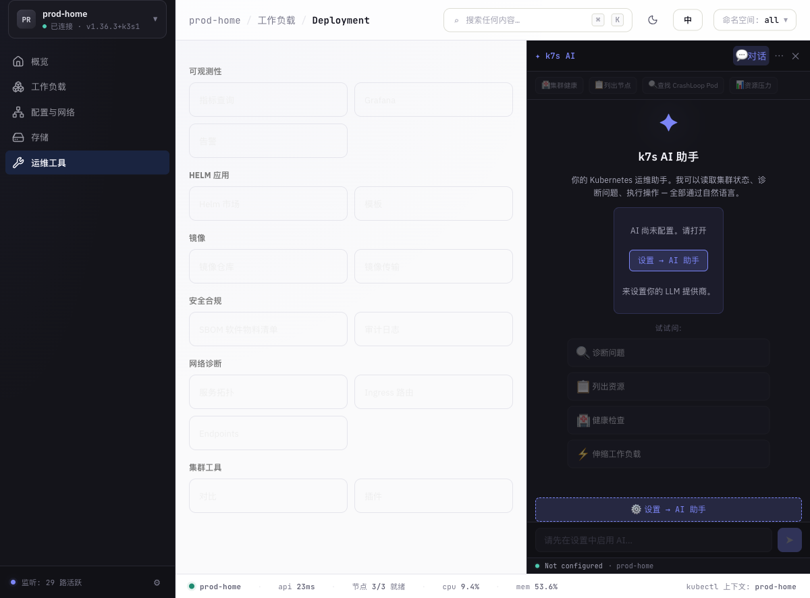

# k7s 使用说明

> 本文档基于 v0.5.1，截图均为连接真实集群（K3s v1.36）的 Web 模式实拍。

## 目录

1. [安装](#1-安装)
2. [连接集群](#2-连接集群)
3. [界面导览](#3-界面导览)
4. [常用操作](#4-常用操作)
5. [网络诊断](#5-网络诊断)
6. [可观测性](#6-可观测性)
7. [安全与镜像](#7-安全与镜像)
8. [AI 助手](#8-ai-助手)
9. [快捷键](#9-快捷键)
10. [Web 服务器模式](#10-web-服务器模式)
11. [MCP 接入](#11-mcp-接入)
12. [常见问题](#12-常见问题)

---

## 1. 安装

### 桌面版（推荐）

从 [Releases](https://github.com/yi-nology/k7s/releases) 下载对应平台安装包：

| 平台 | 文件 |
|---|---|
| macOS (Apple Silicon) | `k7s_0.5.1_aarch64.dmg` |
| macOS (Intel) | `k7s_0.5.1_amd64.dmg` |
| Windows | `k7s_0.5.1_x64-setup.exe` |
| Linux x64 | `k7s_0.5.1_amd64.AppImage` / `.deb` / `.rpm` |
| Linux ARM64 | `k7s_0.5.1_aarch64.AppImage` / `.deb` / `.rpm` |
| 麒麟/旧 glibc 系统 | `k7s-linux-x86_64-glibc231.AppImage`（内嵌 glibc 2.35，兼容 glibc ≥ 2.31） |

桌面版自动读取 `~/.kube/config`，启动即连。

### Web 服务器版（单二进制）

适合在服务器上常驻、团队通过浏览器访问：

```bash
# 下载静态二进制（musl 编译，无任何系统依赖，Linux 通吃）
curl -LO https://github.com/yi-nology/k7s/releases/download/v0.5.1/k7s-web-linux-x86_64-static
chmod +x k7s-web-linux-x86_64-static
./k7s-web-linux-x86_64-static --port 7180
```

启动后终端打印访问地址；**无浏览器的服务器会自动跳过打开浏览器**并提示，`--no-open` 可显式关闭。

### Docker

```bash
docker run -d --name k7s \
  -p 7180:8080 \
  -v ~/.kube/config:/home/k7s/.kube/config:ro \
  ghcr.io/yi-nology/k7s:0.5.1
```

## 2. 连接集群

- **默认 kubeconfig**：自动发现 `~/.kube/config`（及 `KUBECONFIG` 环境变量），启动时连接上次使用的上下文。
- **导入多个 kubeconfig**：左下角集群切换器 →「导入」，可导入任意路径的 kubeconfig 文件；所有上下文合并进切换列表，重启后自动重导入。
- **多集群切换**：点击左下角集群徽标随时切换，表格、监听器、拓扑全部随切换刷新。



## 3. 界面导览

### 概览仪表盘

左侧「概览」：节点就绪状态、集群 CPU/内存水位、各命名空间资源分布、最近事件流。


### 资源表格

左侧按域分组（工作负载 / 配置与网络 / 存储 / 运维工具），表格支持：

- 列排序、`名称或 key=value` 过滤、CSV 导出
- 顶部命名空间选择器（all / 单命名空间）
- 每行「详情」与「更多操作」（扩缩容、重启、删除等）
- 数据实时推送（表格底部显示活跃 watcher 数量），无需手动刷新



### 资源详情

点击任意资源打开详情面板：摘要、Pod 列表（含重启次数与状态）、事件、YAML（语法高亮 + 行内编辑 + dry-run diff）、指标图表等标签页。



### 命令面板

`⌘K / Ctrl+K` 打开，模糊搜索跳转任意资源、命名空间或动作。



## 4. 常用操作

| 操作 | 入口 |
|---|---|
| 编辑并应用 YAML | 详情 → YAML → 编辑（桌面默认需确认，含 dry-run 对比） |
| 扩缩容 | Deployment/StatefulSet 行菜单 → Scale |
| 重启 Pod / 滚动回滚 | 行菜单 / 详情 → 发布历史 |
| 实时日志 | Pod 详情 → 日志（流式、关键词过滤、导出） |
| Web 终端 | Pod 详情 → 终端（xterm，容器内 shell）；节点调试 shell（特权 Pod） |
| 端口转发 | 顶部「转发」栏：Pod/Service 端口映射到本地 |
| 排空节点 | 节点行菜单 → Drain（遵守 PDB） |
| 模板部署 | 「新建」→ 多文档 YAML 模板 / Helm 市场 |

### Helm 市场与本地 Charts 库

Helm 市场除浏览仓库 chart 外，提供「本地 Charts」tab——一个落在 `<data_dir>/charts/` 的本地 chart 库：

- **上传**：选择 `.tgz` / `.tar.gz` 包（≤50MB，且需为合法 gzip），入库时自动解析 Chart.yaml；web 模式走认证路由 `POST /api/charts/upload`（90MB 路由上限 + 50MB 业务上限）。
- **目录型 chart**：无需打包，把含 `Chart.yaml` 的目录直接放到 `<data_dir>/charts/` 下即可被扫描识别。
- **浏览与详情**：列表支持删除；详情面板可查看文件树、values 与 README。
- **从本地 chart 安装/升级**：详情 →「安装此 chart」进入向导，chart 引用即本地包的绝对路径（helm 原生路径引用），命名空间、values 编辑等向导能力与仓库 chart 一致。
- **安装/升级开关**：helm install/upgrade 支持 `--set` 覆盖、`--atomic`（失败自动回滚）、`--force`、自定义 `--timeout`；upgrade 另支持 `--create-namespace`。
- **审计**：入库与删除分别写入 `local_chart_import` / `local_chart_remove` 审计事件。

## 5. 网络诊断

「运维工具 → 网络诊断」：

- **服务拓扑**：Ingress → Service → EndpointSlice → Pod 的力导向图，命名空间分组、健康着色、悬停高亮链路、小地图导航、搜索定位。
- **Ingress 路由**：按 Host/Path 树状展示路由规则与后端。
- **连通性模拟**：NetworkPolicy 语义模拟——"这个 Pod 能不能连到那个 Service"，排障不用再猜。
- **Ingress 调试**：一键诊断路由不生效（后端缺失、TLS、控制器配置）。



## 6. 可观测性

「运维工具」内：

- **指标浏览**：多 Prometheus 实例管理，即时 PromQL 查询 + 区间曲线；常用查询可保存复用。
- **Grafana**：多实例管理、仪表盘搜索与跳转嵌入。
- **告警**：AlertManager 告警浏览、静默管理；Prometheus 规则查看。
- **日志与审计**：Loki 多实例查询；K8s 审计事件流。

## 7. 安全与镜像

- **RBAC 审计**：权限矩阵（谁能在哪个命名空间对什么资源做什么）、越权扫描报告。
- **SBOM**：对镜像或整个集群生成软件物料清单（trivy/grype 驱动），历史版本对比与导出。
- **镜像仓库**：多 registry 管理、仓库/标签浏览、manifest 详情。
- **镜像传输**：气隙场景的镜像导入/导出/节点间同步（skopeo）。

## 8. AI 助手

右上角 ✦ 打开。内置 ReAct Agent，可查询集群、诊断问题、执行修复：

- **配置**：设置 → AI，填入任意 OpenAI 兼容 API（也支持 Ollama 等本地模型发现）。
- **权限模式**：桌面端默认「读确认写」——AI 的每个写操作弹窗确认；可切换全自动或纯只读。
- **Web 模式强制只读**：浏览器访问时 AI 一律只读，无法执行写操作。
- 附带集群记忆（四层知识库）、定时任务（cron）、技能市场。



## 9. 快捷键

| 按键 | 功能 |
|---|---|
| `⌘K / Ctrl+K` | 命令面板 |
| `/` | 聚焦表格过滤框 |
| `Esc` | 关闭面板 / 取消 |
| `⌘,` | 设置 |
| `j / k` | 表格上下移动 |
| `Enter` | 打开选中项详情 |

（完整列表：命令面板输入 `?` 或查看设置 → 快捷键帮助）

## 10. Web 服务器模式

`k7s-web` 的运维细节：

```bash
k7s-web --bind 0.0.0.0 --port 80 --no-open     # 局域网访问
K7S_WEB_TOKEN=xxx k7s-web --bind 0.0.0.0       # 非 loopback 必须设 token
k7s-web --static ./dist                        # 外置前端目录（热更新调试）
k7s-web --version                              # 版本
```

- **本机访问**（127.0.0.1）：自动生成 token 并由页面自取，无感使用。
- **局域网访问**：必须设置 `K7S_WEB_TOKEN`，或启用单用户密码门（首次访问设置密码，argon2 哈希落盘，HttpOnly 会话 7 天）。
- **Webhook**：`K7S_HOOK_TOKEN` 启用 `/hooks/wake|agent|event`，供监控系统/CI 触发 AI 诊断。
- **无头服务器**：检测不到浏览器时自动跳过打开（v0.5.1+）。

## 11. MCP 接入

k7s 内置 MCP 服务器（96 个工具），可接入 Claude Desktop、Cursor 等任意 MCP 客户端：

```json
{
  "mcpServers": {
    "k7s": { "command": "/path/to/k7s-mcp" }
  }
}
```

也可用 Web 模式的 Streamable HTTP 端点：`http://<host>:<port>/mcp`。工具覆盖：资源读写、日志、exec、端口转发、Helm、指标查询、RBAC 审计、SBOM 等。

## 12. 常见问题

**Q：表格里 CPU/MEM 显示 `—`？**
集群未装 metrics-server 或其未就绪；安装后 1-2 个采集周期内自动出现。

**Q：Web 模式 401？**
本机访问不应出现；局域网访问需在 URL 首次访问时完成密码门，或请求头带 `Authorization: Bearer <K7S_WEB_TOKEN>`。

**Q：连不上集群？**
检查 kubeconfig 中 server 地址在本机是否可达（跳板机场景先 `ssh -L`）；证书过期会在连接横幅显示具体错误。

**Q：AI 报错 / 无响应？**
设置 → AI → 「测试连接」验证 API 可达；本地模型确认 Ollama 等服务已启动。

**Q：Linux 桌面版报 glibc 版本错误？**
改用 `k7s-linux-x86_64-glibc231.AppImage`（自带 glibc）或 `k7s-web-*-static`。
